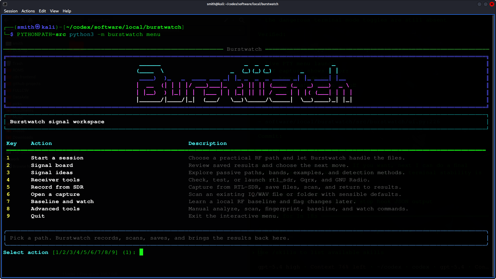
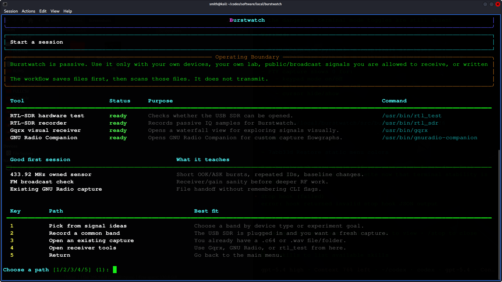
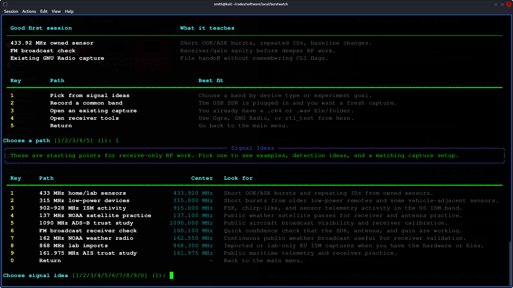
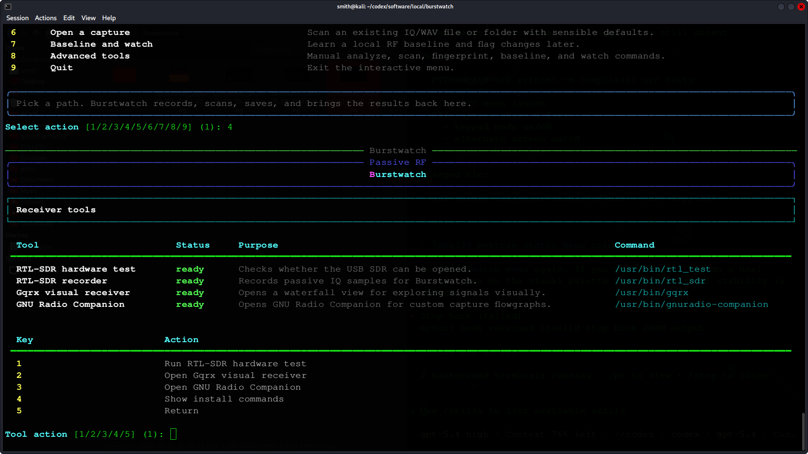
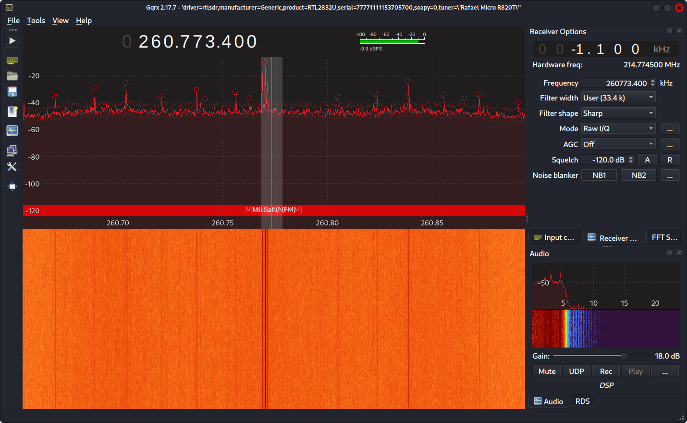
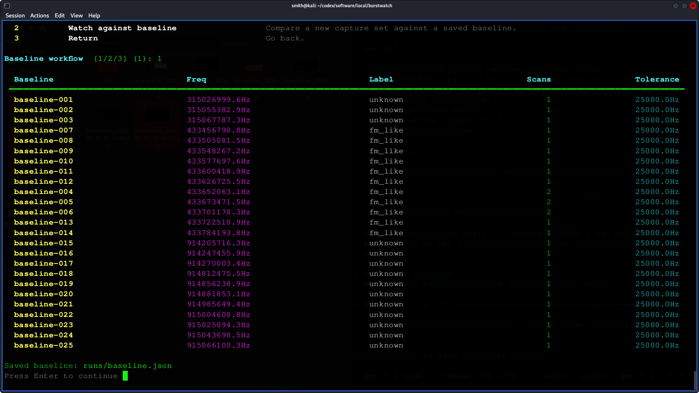

# Burstwatch

[](https://www.python.org/)
[](https://www.gnuradio.org/)
[](https://osmocom.org/projects/rtl-sdr/wiki/Rtl-sdr)
[](https://github.com/Textualize/rich)
[](https://numpy.org/)
[](https://opensource.org/license/mit)

Burstwatch is a passive RF signal workspace for RTL-SDR users who want one place to record short captures, scan them, review results, build baselines, and watch for changes over time. It is designed for owned hardware, lab devices, public broadcasts, and other clearly authorized receive-only work.

Burstwatch does not transmit. It does not claim to decode private traffic. It focuses on saved captures and reviewable local artifacts: burst timing, approximate bandwidth, signal-shape labels, repeated emitters, and changes against a known baseline.

[](screencap/menu-home.png)

## Why Burstwatch

Burstwatch is built around a simple public workflow:

- launch one menu
- check tool availability
- record or open a capture
- scan it with sensible defaults
- save results into `runs/`
- come back later for the signal board, baseline creation, or watch mode

That keeps the workflow approachable without hiding the underlying CLI for repeatable scripting.

## Scope And Legal Use

Use Burstwatch only with:

- your own SDR hardware
- your own lab devices
- your own saved captures
- public or broadcast signals you are legally allowed to receive
- targets where you have explicit written authorization

Do not use this project to:

- intercept private communications
- target public-safety systems
- target third-party vehicles
- collect cellular subscriber data
- profile nearby third-party devices without authorization

Radio monitoring rules vary by country, band, and service. You are responsible for staying inside the law and inside the scope you actually control.

## Features

- menu-first terminal workspace for the normal workflow
- passive RTL-SDR capture through `rtl_sdr`
- existing IQ or WAV import path
- burst detection and coarse shape labeling
- scan summaries for recurring emitter candidates
- fingerprints for recurring owned/lab devices
- baseline creation from prior scan summaries
- watch reports for new or changed activity
- JSON and JSONL artifacts for local review or SOC ingestion
- receiver tool launcher for `rtl_test`, Gqrx, and GNU Radio Companion

## Requirements

Burstwatch itself requires:

- Python 3.10 or newer
- `numpy`
- `rich`

Optional external tools:

- `rtl_sdr` for direct capture
- Gqrx for live waterfall inspection
- GNU Radio Companion for custom capture flowgraphs

On Kali and other modern Linux distributions, the system Python may be externally managed. Use a virtual environment instead of installing directly into the system interpreter.

## Installation

### 1. Clone the repo

HTTPS:

```bash
git clone https://github.com/Clock-Skew/Burstwatch.git
cd Burstwatch
```

SSH:

```bash
git clone git@github.com:Clock-Skew/Burstwatch.git
cd Burstwatch
```

### 2. Create and activate a virtual environment

```bash
python3 -m venv .venv
source .venv/bin/activate
```

### 3. Install Burstwatch in editable mode

```bash
pip install -e .
```

### 4. Install optional SDR tools

```bash
sudo apt update
sudo apt install -y rtl-sdr gnuradio gqrx-sdr
```

## Quick Start

Launch the menu:

```bash
burstwatch menu
```

Recommended first run:

1. Choose `1 Start a session`
2. Review the operating boundary and tool status
3. Pick a common band or an existing capture
4. Let Burstwatch save the capture and run the scan
5. Open `2 Signal board` to review what was written

If you already have capture files:

1. Launch `burstwatch menu`
2. Choose `6 Open a capture`
3. Point Burstwatch at a `.c64`, `.wav`, or a folder of captures
4. Review the saved JSON outputs in `runs/`

## Screens

[](screencap/start-session.png)

[](screencap/signal-ideas.png)

[](screencap/receiver-tools.png)

[](screencap/gqrx-handoff.png)

[](screencap/baseline-watch.png)

## Menu Walkthrough

### `1 Start a session`

Best first stop for most users. It combines:

- operating boundary
- tool readiness
- common starting points
- quick path selection

### `2 Signal board`

Review saved result files from `runs/`. This is where you check:

- the latest scan summaries
- baseline files
- watch reports
- common band references
- next-step suggestions

If nothing has been saved yet, the board says:

```text
No JSON yet.
```

That means you need to run a capture or import step first.

### `3 Signal ideas`

Passive starting points for common receive-only work, including:

- 433.92 MHz owned sensors
- 315 MHz low-power devices
- 868 MHz imported or lab captures
- 902-928 MHz ISM activity
- 137 MHz NOAA satellite practice
- 162 MHz NOAA weather radio
- 161.975 MHz AIS visibility practice
- 1090 MHz ADS-B visibility
- FM broadcast receiver sanity checks

### `4 Receiver tools`

One place to:

- run `rtl_test`
- confirm `rtl_sdr` is installed
- launch Gqrx
- launch GNU Radio Companion
- view install commands if tools are missing

### `5 Record from SDR`

Direct capture from an RTL-SDR device. Burstwatch will ask for:

- center frequency
- sample rate
- duration
- gain
- device index
- optional PPM correction
- destination paths

Then it records, converts the raw samples, writes metadata, and returns to saved artifacts.

### `6 Open a capture`

Import a file or folder you already have. Useful for:

- GNU Radio file sinks
- existing `rtl_sdr` captures
- saved WAV test material
- repeated batch analysis

### `7 Baseline and watch`

Create a normal local profile from prior scan summaries, then compare later captures against that baseline.

### `8 Advanced tools`

Direct access to the scriptable commands for users who want repeatable batch workflows.

## Signal Ideas And Passive Approaches

| Path | Center | Good For | What Burstwatch Looks For |
| --- | ---: | --- | --- |
| 433 MHz home/lab sensors | 433.920 MHz | Owned weather stations, door sensors, soil sensors, remotes | OOK/ASK bursts, repeated IDs, recurring timing |
| 315 MHz low-power devices | 315.000 MHz | Owned remotes, lab transmitters, your own TPMS presence checks | Short bursts, duty cycle, time gaps |
| 868 MHz lab imports | 868.300 MHz | Imported devices and owned EU lab captures | Narrow telemetry activity and timing |
| 902-928 MHz ISM activity | 915.000 MHz | Owned LoRa-style modules, sensors, hobby telemetry | Chirp-like or FSK-like patterns, channel occupancy |
| 137 MHz NOAA practice | 137.100 MHz | Public NOAA APT passes | Wide-signal presence and pass timing |
| 162 MHz NOAA weather radio | 162.550 MHz | Continuous weather broadcast | Carrier presence, gain checks, overload clues |
| 161.975 MHz AIS study | 161.975 MHz | Public maritime telemetry visibility | Burst density and receiver-placement checks |
| 1090 MHz ADS-B study | 1090.000 MHz | Public aircraft telemetry visibility | Pulse density and trust-study starting points |
| FM broadcast receiver check | 100.100 MHz | Fast receiver confidence check | Front-end sanity, gain, antenna placement |

Useful passive approaches:

- burst discovery for short on-air events
- shape labeling for OOK/ASK, FSK, chirp-like, or FM-like activity
- repetition timing for regularly scheduled devices
- frequency grouping for recurring emitters near the same center frequency
- baseline and watch for local-environment drift
- waterfall-first validation in Gqrx before capture
- JSONL export for downstream SIEM or timeline use

## Files And Output Layout

Burstwatch uses two working directories by default:

- `captures/` for saved IQ capture files
- `runs/` for saved JSON and JSONL artifacts

Common output files:

- `*-capture.json`: capture metadata
- `*-scan.json`: emitter candidate summary
- `*-events.jsonl`: one burst event per line
- `*-fingerprints.json`: recurring-device fingerprint summary
- `baseline.json`: learned baseline from prior scans
- `*-watch.json`: new or changed activity compared with a baseline

Repository layout:

```text
burstwatch/
├── src/burstwatch/
├── tests/
├── screencap/
├── README.md
├── LICENSE
└── pyproject.toml
```

## Command Reference

### Show the menu

```bash
burstwatch menu
```

### Show tool status

```bash
burstwatch tools
```

### Review saved JSON outputs

```bash
burstwatch dashboard runs
```

### Record a short passive capture

```bash
burstwatch capture captures/433920000-lab.c64 \
  --center-freq 433920000 \
  --sample-rate 2400000 \
  --duration 10 \
  --metadata-json runs/433-capture.json
```

### Analyze a single saved capture

```bash
burstwatch analyze captures/433920000-lab.c64 \
  --sample-rate 2400000 \
  --center-freq 433920000
```

### Scan one file or a whole folder

```bash
burstwatch scan captures/433/ \
  --sample-rate 2400000 \
  --center-freq 433920000 \
  --recursive \
  --json-out runs/433-scan.json
```

### Build recurring-device fingerprints

```bash
burstwatch fingerprint captures/lab-session-a/ captures/lab-session-b/ \
  --sample-rate 1024000 \
  --center-freq 915000000 \
  --recursive \
  --freq-bin-hz 10000 \
  --name-prefix lab915 \
  --json-out runs/lab915-fingerprints.json
```

### Build a baseline from prior scans

```bash
burstwatch baseline runs/morning-scan.json runs/afternoon-scan.json runs/evening-scan.json \
  --freq-bin-hz 5000 \
  --json-out runs/lab-baseline.json
```

### Watch new captures against a saved baseline

```bash
burstwatch watch runs/lab-baseline.json captures/fresh/ \
  --sample-rate 2400000 \
  --center-freq 433920000 \
  --recursive \
  --json-out runs/lab-watch.json
```

### Emit JSONL for a SOC pipeline

```bash
burstwatch scan captures/433/ \
  --sample-rate 2400000 \
  --center-freq 433920000 \
  --event-jsonl runs/433-events.jsonl \
  --json-out runs/433-scan.json
```

## GNU Radio Handoff

Burstwatch works well with a file-first GNU Radio workflow:

```text
RTL-SDR Source
-> Frequency Xlating FIR Filter or direct pass-through
-> File Sink
```

Set the file sink to write complex samples, record a short capture, then return to Burstwatch:

```bash
burstwatch menu
```

Choose `6 Open a capture`, point it at the saved GNU Radio output, and let Burstwatch handle the scan and saved artifacts.

## Troubleshooting

### `No JSON yet.`

The dashboard only shows saved JSON outputs. Run one of these first:

- `burstwatch menu`
- `burstwatch capture ...`
- `burstwatch scan ... --json-out runs/scan.json`

### `rtl_sdr` is missing

Install the external tool:

```bash
sudo apt install -y rtl-sdr
```

Then re-run:

```bash
burstwatch tools
```

### Gqrx or GNU Radio will not open

Install the packages:

```bash
sudo apt install -y gqrx-sdr gnuradio
```

Then return to `4 Receiver tools` in the menu.

### The system Python refuses install changes

Use a virtual environment:

```bash
python3 -m venv .venv
source .venv/bin/activate
pip install -e .
```

### Menu colors or keyboard behavior look wrong

Burstwatch intentionally uses a stable terminal path:

- direct stdin menu prompts
- static ANSI styling
- no alternate-screen mode
- no keypad-mode toggles
- no live spinner widgets in the interactive menu

If the terminal still behaves strangely, test the same menu in another terminal emulator to isolate host-terminal behavior from Burstwatch itself.

## Development

Run the test suite:

```bash
PYTHONPATH=src python3 -m unittest discover -s tests -v
```

Run compile checks:

```bash
PYTHONPATH=src python3 -m compileall src tests
```

## License

MIT. See [LICENSE](LICENSE).
